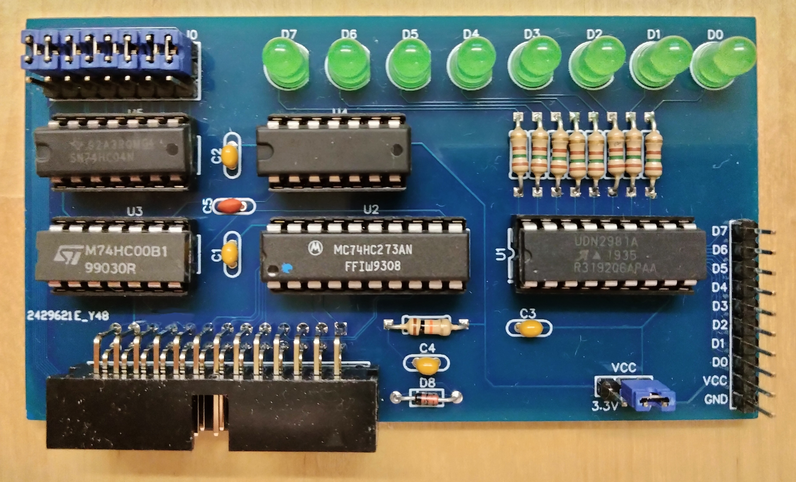

## LED Output Register

One advantage of the IMSAI 8080 over the Altair 8800 was the output
register at address 255 which would display the output value on a 
set of 8 LEDs on the front panel. This allowed for some crude but simple
way of displaying data without needing any other devices.
This simple card reproduces such a register for the Altair.

The standard I/O port for this output register on the IMSAI was 255
(to coincide with the input port for the front-panel switches) so all 
address selection jumpers should be in the "up" position.

By changing the jumpers, multiple of these I/O cards can be
installed at the same time and individually addressed. Setting
the address to the same as a different I/O board (e.g. the serial output 
board) provides a crude way of monitoring the data that sent to other boards.

The "VCC" selection jumper switches the output voltage of the VCC and D0-D7
pins on the right edge of the card. Note that this jumper must be installed
even if the output pins are not used (either position is fine in that case).

To output a value to the LEDs in BASIC just execute "OUT 255,x" where
x is a byte value (0-255). The LEDs will display the binary representation
of the given value.

Schematics and PCB as well as a Gerber file for PCB production are in this directory. 
The project is also available on EasyEDA: https://oshwlab.com/hansel72/outputff
