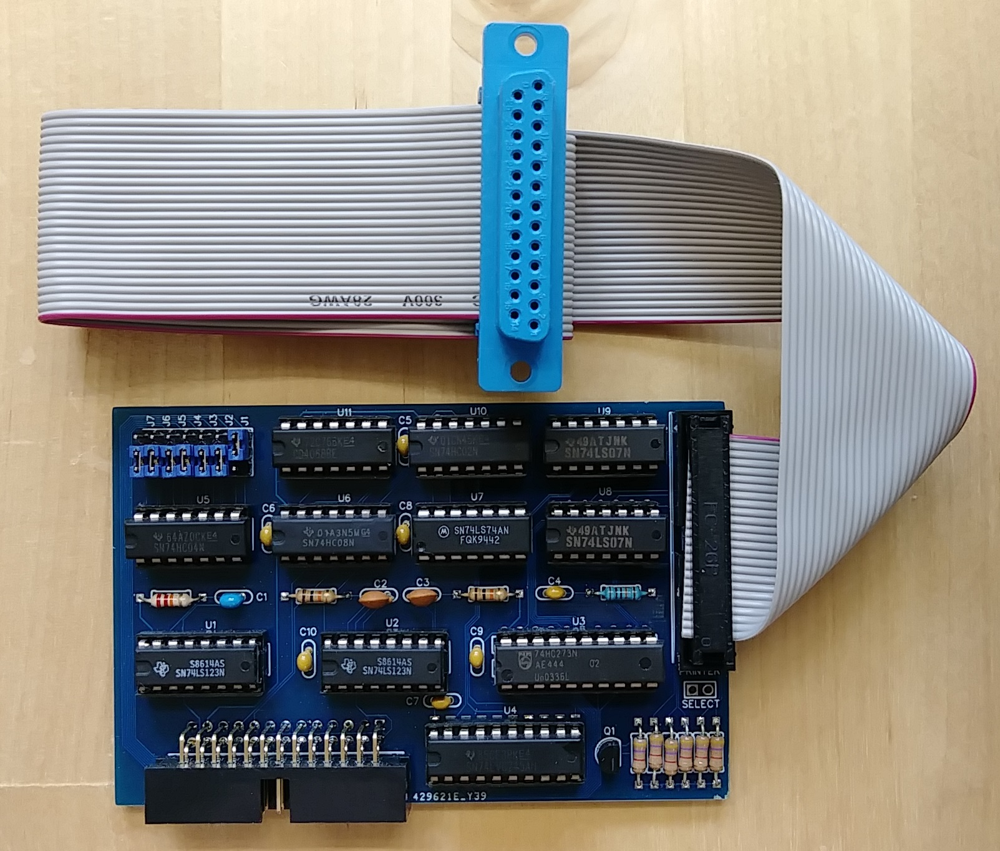

## Centronics interface (88-C700)

The 88-C700 centronics interface card allows connecting a centronics
printer and printing from Altair BASIC (select 'C' for printer type)
and CP/M.

Use a regular Centronics printer cable for connecting the female DB-25 plug
to a Centronics printer.

Schematics and PCB as well as a Gerber file for PCB production are in this directory. 
The project is also available on EasyEDA: https://oshwlab.com/hansel72/88-c700
