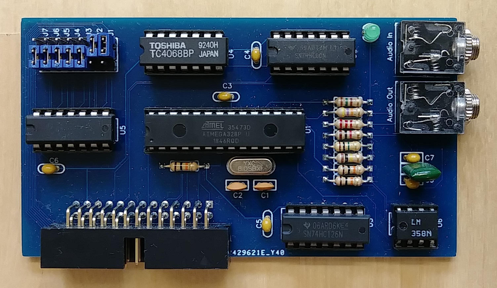

## Cassette interface (88-ACR)

This is an adaptation of my separate [ACRModem](https://github.com/dhansel/ACRModem) 
project that can plug directly into the I/O bus. Since it works on the I/O bus it
does not take up a serial port on the Altair 8800 simulator. Disable the emulated
88-ACR card in the simulator by setting it to "not mapped". Altair software generally
expects the ACR card at I/O address 06h/07h so address jumpers J1 and J2 should be "up"
and all others should be "down".

Schematics and PCB as well as a Gerber file for PCB production are in this directory. 
The project is also available on EasyEDA: https://oshwlab.com/hansel72/2sio_copy_copy

### Supported tape formats

The initial firmware version supported reading and writing the MITS tape format
(2400Hz for a "1" bit, 1850Hz for a "0" bit at 300 baud) as well as reading KCS format tapes.

The latest firmware version adds support for writing KCS format tapes (2400Hz for a "1"
bit, 1200Hz for a "0" bit at 300 baud) as well as reading and writing CUTS format tapes (1200Hz for
a "1" bit, 600Hz for a "0" bit at 1200 baud).

Switching tape formats is done by writing to the first card register (address 6 if the
address jumpers are set as shown above). The following values can be used to switch formats:
  - `00h` or `60h`: MITS mode: read and write MITS format, also read KCS format (default)
  - `40h` or `80h`: CUTS mode: read and write CUTS format.
  - `A0h`: KCS mode: read and write KCS format

For example, if you are in BASIC and would like to save a tape in KCS format (as opposed to
the default MITS format), issue the following command to switch the ACR card into KCS mode: `OUT 6, &HA0`.

Since MITS mode is the default and MITS software does not write to address 6, the card
will work with MITS software without any configuration necessary.

The format selection values shown above are chosen to match the values used by the 
Processor Technology [SOLOS CUTER tape OS](https://www.autometer.de/unix4fun/z80pack/ftp/altair/Processor_Technology_Solos_Cuter_Users_Manual.PDF). On the Altair I recommend
Udo Munk's adaptation of CUTER for MITS ([HEX](https://www.autometer.de/unix4fun/z80pack/ftp/altair/cuter-mits.hex), 
[ASM](https://www.autometer.de/unix4fun/z80pack/ftp/altair/cuter-mits.asm)) which is set up for the MITS default tape port and status
bits. Within CUTER issue the following commands to switch formats:
  - `SET TAPE 0`: read and write CUTS format (default)
  - `SET TAPE 1`: read and write KCS format
  - `SET TAPE 1`, followed by `GET /2` or `SAVE /2`: read and write MITS format

In case the format selection via writing to address 6 causes problems or is not desired,
it can be disabled by connecting pin 16 of the ATMega328P to ground (pin 8 or 22).

### Signal indicator LED

The LED on the PCB will light up if the card is receiving an audio signal that is roughly
in the expected frequency range for the selected tape format. The LED should be on continuously
while the tape is playing. If the LED cuts out (even for a very short period), reading 
tapes will not work. Adjust the volume of whatever generates the signal until the LED is steady on.

When reading CUTS format, it is important for the card to see equally long half-waves in the audio
signal. This is necessary because a "0" bit in CUTS format is only a single 600Hz half-wave and a "1"
bit is a 1200Hz full-wave. If the audio volume is too high or too low, the 1-bit A/D conversion of the
audio signal may skew more toward either high or low. This can cause the decoder to see non-equal 
half-wave lengths and may lead to incorrect reads. To help adjust the volume setting, in CUTS mode, the
LED will only light if a signal with reasonably close half-waves is detected. Since the audio
of actual CUTS data is a mix of "0" and "1" bits, the LED will NOT come on when starting to play
in the middle of a data stream. The LED *will* come on when starting within or before the leader signal ( 
which is a continuous series of 1200Hz "1" waves), provided the correct frequency and half-wave lengths 
are seen.

Note that a green LED does **not** guarantee that the ACR card is interpreting the audio data correctly.
It only means that the audio frequency seen at the input is roughly within the expected range. Read errors
may still occur if frequencies temporarily deviate too much from the selected format's frequencies.

### Automatic speed skew compensation

The latest firmware introduces a feature to automatically compensate for differences in
tape speed. For example if a tape was recorded on a tape recorder that ran faster or slower
than the one used to play back, the regular decoding may fail since the audio signals are
outside of the expected frequency range.

Speed skew compensation can be enabled by connection pin 28 of the ATMega328p to ground (pin 8 or 22).
If enabled, the ACR card will adjust its expectation of the signal frequencies according to the freqency
of the leader signal seen when starting to read.

Speed skew compensation is **not** enabled by default because, if enabled, KCS tapes can not be
read while in MITS mode. In most cases speed skew compensation should not be necessary but it can
be helpful to read tapes that were recorded at moderately incorrect speeds (or if your tape unit
happens to run a bit fast or slow).

### Programming the ATMega328P

The preferred method to program the ATMega328P chip is to use a
programmer such as the MiniPro TL866 or other that allows you to
directly program a .HEX file into the ATMega. Use the ACR.hex file
provided in this directory. **Important:** Program the fuse settings
("Config" button in the TL866 interface) to
Fuse Low=0xFE, Fuse High=0xD7, Extended Fuse Byte=0xFD

If you do not have a programmer you can use an Arduino UNO to program
the ATMega chip:
1) Connect the Arduino UNO to your PC
2) Start the Arduino IDE
3) In the Arduino IDE, select File->Examples->ArduinoISP
4) Select Tools->Board and set it to "Arduino UNO"
5) Select Tools->Port and select the serial port under which your Arduino UNO shows up
6) Select Sketch->Upload
7) Wire the ATMega chip to the Arduino UNO as shown [in this diagram](doc/BreadboardAVR.png)
8) In the Arduino IDE, load the ACR/ACR.ino file from this repository
9) Select Tools->Board and set it to "Arduino Pro or Pro Mini"
10) Select Tools->Processor and set it to "ATMega328P (3.3V, 8MHz)"
11) Select Tools->Programmer and set it to "Arduino as ISP" (**not** ArduinoISP!)
12) Select Tools->Burn Bootloader (this will program the correct fuse settings)
13) Select Sketch->"Upload using Programmer" (**not** Sketch->Upload)
