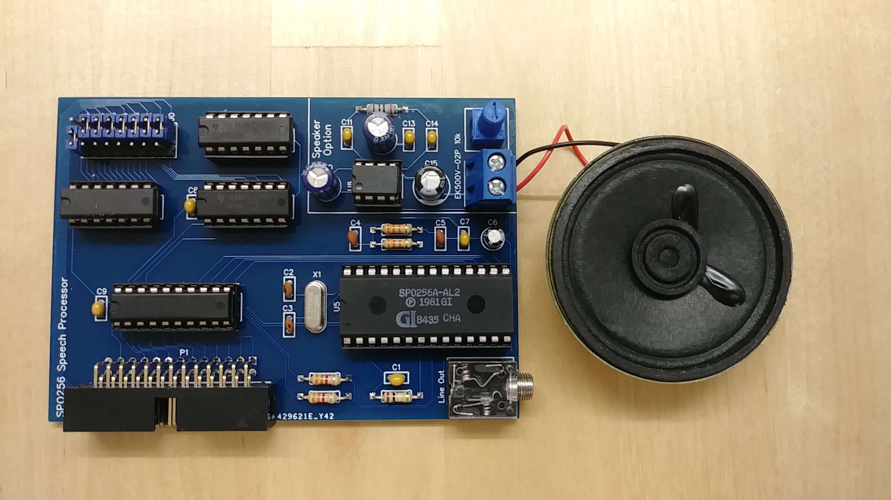

## Speech processor card

This card is not based on an existing card for the Altair. There
must have been some cards to provide speech output but I am not
aware of any such card.  This card is an "original" design by me,
attaching a [General Instruments SP0256-AL2](https://en.wikipedia.org/wiki/General_Instrument_SP0256)
speech processor to the I/O bus.



### Sourcing the SP0256-AL2 chip

The hardest part of building this card will be to find a good source
for a SP0256-AL2 chip. Unfortunately there are many fakes out on EBay
and such so be careful where you order. I got mine from 
[Sciencescore.uk](http://sciencestore.co.uk/acatalog/Electronics.html)
(see bottom of linked page).

### Audio output

The card outputs a line level signal on the 3.5mm connector that can be
connected to any audio amp. Additionally it contains a simple audio amplifier
circuit that allows to drive a small speaker directly from the board. Note
that this part of the circuit is optional and can be left out if not needed.

### Programming

Like all other I/O devices the speech processor card is addressed by its I/O
port. The port used by the card can be configured using the jumpers on the
top left of the board. In the picture above it is set to 127.  Since there is
no existing software that uses this card you are free to choose whichever port
you like.

To output speech, write the proper allophone numbers to the card via the OUT command
(in BASIC or assembler). Take a look at the [SP0256 documentation](doc/sp0256.pdf) to understand
how the chip produces speech from allophones. [This webpage](https://greg-kennedy.com/sp0256-tts)
contains a translator that produces allphones for a string of english text. Its
output is a list of allophone names which can be translated to the proper numbers
using the tables at the end of the [SP0256 documentation](doc/sp0256.pdf).

If data is written to the chip too fast then it may be lost and the output will
be garbled. Writing data too slowly can produce gaps in the speech output. 
To check whether the chip is ready for more data, read the card's I/O address via
the INP command. If bit 7 is clear (zero) then the SP0256 is ready to receive more data.

### Example code

The code below shows a "Hello World" BASIC example of how to write speech data 
to the card. Note that in order to change the output all you have to do is change
the DATA statements at the end of the program. The data needs to end with a "-1"
to indicate end-of-data. The program assumes the speech processor card is at I/O address 127.

```
10 READ A:IF A<0 THEN END
20 OUT 127,A
30 IF INP(127) AND 128 THEN 30
40 GOTO 10
100 DATA 27,7,45,53,2,46,51,45,21,2,-1  
```

### Card schematics

Schematics and PCB as well as a Gerber file for PCB production are in this directory. 
The project is also available on EasyEDA: https://oshwlab.com/hansel72/iobus-speech-processor-spo256
