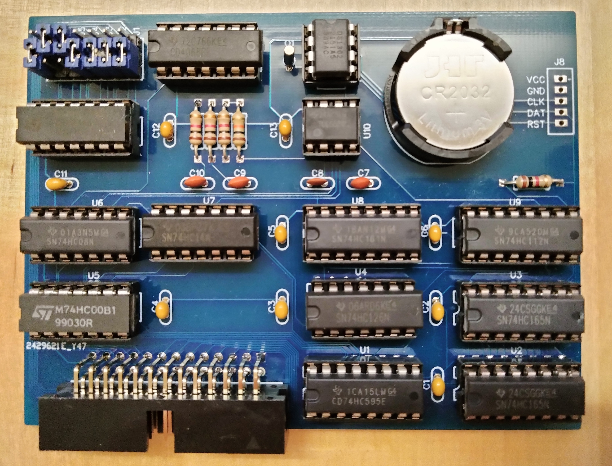
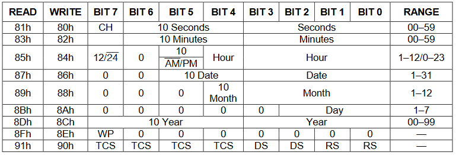

## Timekeeping card

This card adds battery-backed Real-Time-Clock/timekeeping capabilities via the [DS1302](doc/DS1302.pdf) chip.

The DS1302 is a widely used chip which provides the current time and date in
several easy-to-read registers. The DS1302 itself is a small 8-pin package intended
for use with modern microcontrollers that can easily implement the custom serial
protocol used by the chip. Accessing the data through the byte-based (parallel)
architecture of the I/O bus is a bit more tricky. 

As a challenge to myself I decided to use only discrete ICs and no microcontroller on the card. 
This also has the advantage of not needing to program an ATMega or similar in order to make the card.
The downside is a larger chip count to build it.

It is possible to connect a DS1302 to the AltairDuino via the parallel input/output
card but reading and writing the time is tedious and slow (in BASIC). It will also
occupy both the input and output ports of the parallel card.

My goal for this card was to make reading/setting the time simple and fast even in BASIC.
See the example code below.



### Interacting with the DS1302

The Altair can communicate with the DS1302 chip via regular IN/OUT commands, either 
from BASIC or assembly language. First, choose an I/O address for the card by configuring
the J1-J7 jumpers. I have mine set to address 96.

The card uses two registers, a command/status register (at the base I/O address) and
a data register (at base I/O address +1). To write a byte of data to a register on
the DS1302 chip do the following:

1) Put the data to be written into the card's data register (e.g. OUT 97, data)
2) Issue a "write" command in the card's command register (e.g. OUT 96, 128)

To read a byte of data from a DS1302 register do the following:

1) Issue a "read" command in the card's command register (e.g. OUT 96, 129)
2) Read the card's status register (e.g. INP(96)). Bit 7 is 1 while the card is busy reading from the DS1302 and will be 0 when reading has finished.
This step is only necessary when using assembly language as the read process if very fast.
3) Read the data from the card's data register (e.g. INP(97))

Table 3 from the [DS1302 datasheet](doc/DS1302.pdf), reproduced here, shows the DS1302
registers associated with timekeeping:


To issue a "read" command for a register, write the value in the table's READ
column to the card's command register. To issue a "write" command, use the value
in the WRITE column of the table. For example, the BASIC commands
`OUT 96,131:PRINT INP(97)`
will read the minutes register. 
`OUT 97,5:OUT 96,128`
will set the seconds register to 5.

The DS1302 supports 12 or 24 hours format. See the "Clock/Calendar" section
of the DS1302 datasheet for details.

### Example code

The following BASIC code will repeatedly read and print the current time:

```
10 GOSUB 400:PRINT H,M,S:GOTO 10

400 REM -------- get current time in H:M:S
410 R=0:GOSUB 500:S=D:REM read seconds
420 R=1:GOSUB 500:M=D:REM read minutes
430 R=2:GOSUB 500:H=D:REM read hours
440 R=0:GOSUB 500:IF D<S THEN 410
450 RETURN

500 REM -------- read clock register R, return in D
510 OUT 96,129+(R AND 31)*2
520 D=INP(97)
530 D=INT(D/16)*10+(D AND 15)
540 RETURN
```

Notes: 
  - line 440 provides rollover protection: if the seconds changed from 59
to 0 while reading the other registers then we repeat the read. 
  - line 530 converts the value read from the DS1320 from BCD to decimal

The following BASIC code will set the time:
```
10 INPUT "Current time (H,M,S)? ",H,M,S
20 GOSUB 600
30 END

600 REM -------- set current time to H:M:S
610 OUT 97,0:OUT 96,142:REM clear write-protect bit
620 OUT 97,128:OUT 96,128:REM stop clock
630 R=2:D=H:GOSUB 700:REM set hours
640 R=1:D=M:GOSUB 700:REM set minutes
650 R=0:D=S:GOSUB 700:REM set seconds and re-start clock
660 RETURN

700 REM -------- write D to clock register R
710 OUT 97,INT(D/10)*16+(D MOD 10)
720 OUT 96,128+(R AND 31)*2
730 RETURN
```

Notes: 
  - line 610 enables write access to the clock registers
  - line 620 stops the clock before setting it, the clock will restart when the seconds register is set
  - line 710 converts the value from decimal to BCD before writing to the DS1302
