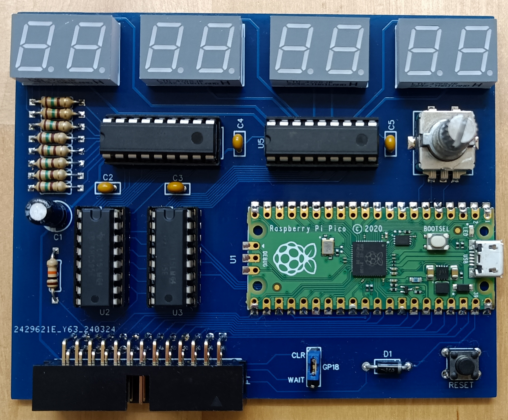

## Bus Monitor

This card allows to monitor all input/output operations happening via the I/O bus 
as well as internally emulated devices on the Altair 8800 Simulator.

Each of the four 7-segment displays can be set to monitor either input or output
operations on any I/O port (0-255).

Furthermore, after connecting a computer to the USB connector all I/O communication
can be recorded. Filtering options are available to select or de-select specific ports.

Schematics and PCB as well as a Gerber file for PCB production are in this directory. 
The project is also available on EasyEDA: https://oshwlab.com/hansel72/iobus-busmonitor

### Uses

The card has several usage scenarios:
- Monitor bus input/output values via the LED displays.
- Monitor all bus operations via USB connections
- Add a display of 4 hex values to your setup:
  - configure the four displays on the card to monitor output operations on otherwise unused ports
  - in your program, any data data written to those ports (e.g. via "OUT 44,123" in BASIC) will show up on the display
- Implement a whole new I/O device (as an example, see the implementation of an 88-SIO [here](devices/SIO)

### Assembly tips

As with all the other I/O bus cards, all components are through-hole soldering.
The Raspberry Pi Pico board can either be mounted via through-hole soldering (using
header pins) or directly soldered onto the board as shown in the picture above.

The "GP18" header is not needed - you can leave it unpopulated. It is just included
for testing and possible future additions. If you do install it, make sure to first break the
connection between CLR and GP18 on the board.

If you are only interested in the capture functionality via USB and not the displays,
you can leave out most of the components: only P1 (the card connector), U1 (the Raspberry 
Pi Pico) and D1 are required in that case.

A BOM with DigiKey part numbers is is available [here](BOM.csv).

### Programming the Raspberry Pi Pico

To program the Raspberry Pi Pico (either before or after assembling the card), do the following:
  - hold down the "Bootsel" button on the Pico
  - connect the USB cable to your PC/Mac
  - release the button
  - your computer should recognize the Pico as a storage device (like a USB stick) and mount it as a drive
  - copy the [BusMonitor.uf2](BusMonitor.uf2) file to the drive mounted in the previous step

After this the Pico will automatically disconnect and then show up again as a serial device.

Alternatively you can opt to load the BusMonitor.ino sketch into the Arduino environment
and upload from there. In that case, make sure to select the "Raspberry Pi Pico/RP2040"
board type (NOT "Arduino Mbed OS RP2040"). After selecting the board and before uploading, 
I recommend setting the Tools->Optimize setting to "Optimize even more (-O3)".

### Updating Arduino Simulator firmware

A small change to the Arduino Simulator firmware was necessary to help properly capture
all data during INP operations. This change has been applied to the Altair8800 repository
on Apri 7, 2024. It is highly recommended to update the simulator firmware, otherwise some
input operations captured by this card may show incorrect values.

### Configuring the 7-segment displays

When first starting up. all four 7-segment displays will be inactive. You can configure
them to show a port's value like this:

  - Select the display to configure by turning the rotary switch. A movable "." will show
    in the bottom center of the selected display.
  - Press down on the rotary switch to configure the selected display. The display will
    start blinking "--". Turn the rotary switch to select between "In" (show input operation),
    "Ou" (show output operation) and "--" (disable display).
  - Press down on the rotary switch to confirm your selection. The display will now blink
    the left digit of the (hexadecimal) port number. Turn the rotary switch to change the setting.
  - Press down on the rotary switch to confirm your selection. The display will now blink
    the right digit of the port number. Turn the rotary switch to change the setting.
  - Press down on the rotary switch to confirm the setting. The display will stop blinking
    and show the last value seen on the selected port.

Settings for the displays are stored in nonvolatile memory so the displays will always
come up just as they were configured previously.

### Monitoring I/O traffic via the USB connector

After plugging into the USB connector and opening a serial terminal, the terminal should
immediately start showing I/O operations. 

In the default configuration:
  - All filters are off, i.e. all bus operations are shown
  - Output is in hex dump format. Each line starts with either "I" or "O",
    representing input/output operations, followed by the port number.
  - 16 hex bytes are shown per line, followed by their (printable) ASCII representations.
  - If the same operation (i.e. same port and same value) repeats for more than one line,
    "..." is printed and output stops until a different operation occurs. At that point
    the number repeats for the previous line is printed and regular output resumes.

Pressing any key will enter configuration mode with the following commands:
  - `filter`
    Display current filter configuration
  - `filter off`
    Disable filter (record everything)
  - `filter inclusive`
    Record operations matching any of the four filter conditions
  - `filter exclusive`
    Record operations not matching any of the four filter conditions
  - `filter all`
    Filter everything (i.e. record nothing)
  - `filter N iD` or `filter N iXXh` 
    Set filter condition N (1-4) to match input operations on port D (decimal) or XX (hex)
  - `filter N iD` or `filter N iXXh` 
    Set filter condition N (1-4) to match output operations on port D (decimal) or XX (hex)
  - `filter N -`
    Disable filter condition N (1-4)
  - `output hex [N]`
    Output in HEX dump format with N (default 16) bytes per line. Each line starts with
    either "I" or "O" (input/output) followed by port number and then data bytes.
  - `output ascii [on|off]`
    Enables or disables display of ASCII characters
  - `output suppress [on|off]`
    Enables or disables suppression of repeated lines of data
  - `output raw`
    Raw data output format. Line format is `IOPPVVRR`:
    - IO either "I" (input operation) or "O" (output operation)
    - PP port number (hex)
    - VV data value (hex)
    - RR number of occurrences (hex, range is 01-7F)
  - `exit`
    Exit configuration and continue capturing

Note that all commands and settings can be abbreviated by their first letter (except "off/on" = 1/0).
For example: `o a 0` disables ASCII output.

