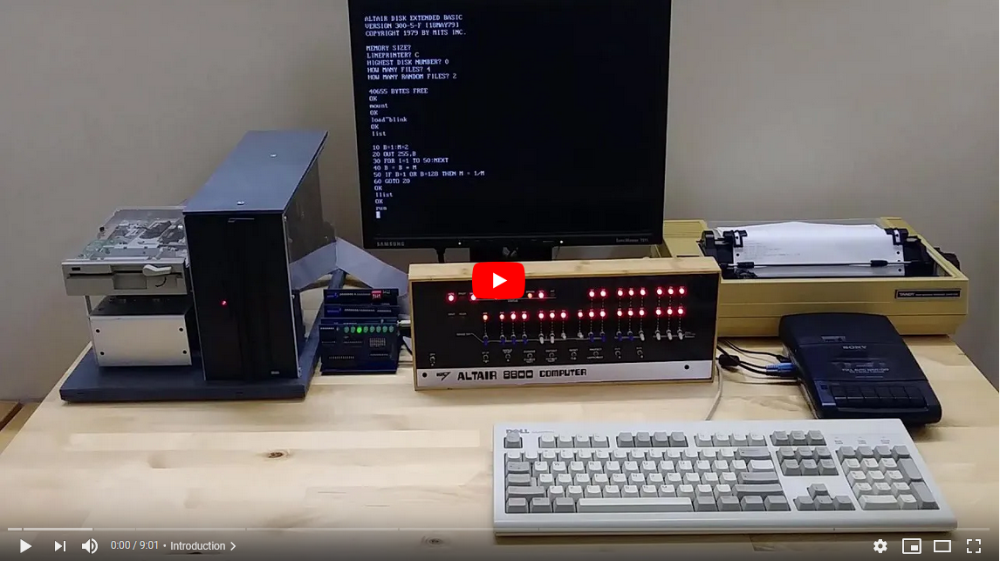

# I/O Bus for Altair 8800 simulator

While thinking about ways to connect more hardware to my
[Altair 8800 Simulator](https://www.hackster.io/david-hansel/arduino-altair-8800-simulator-3594a6) I realized that
the signals that drive the DATA and ADDRESS LEDs, together with a
few control signals (INP, OUT, WAIT) could be used to form a
simple but effective I/O bus.

Such a bus could work very similar to the original S-100 bus and 
allow multiple external devices to be connected and accessed by 
existing emulated software with only minor changes to the emulator 
firmware.

## I/O Bus Basics

When the emulator performs an OUT instruction it sets the A0-7 LEDs
to the output address, sets the D0-7 LEDs to the output data and
then switches the OUT LED on. External hardware connceted to the
bus will see the low->high transition of the OUT signal, can see
whether the proper address is present on A0-7 and if so read the 
data from the D0-7 signals.

When the emulator performs an IN instruction it sets the A0-7 LEDs
to the input address, switches the D0-7 data lines to input mode
and then switches the INP LED on. External hardware will see the
INP signal and can can place the proper data on the D0-7 data lines
for the emulator to read.

In both cases external hardware can pull the WAIT signal high
to indicate that it needs more time to process the IN/OUT
instruction. If so, the emulator will wait until WAIT goes
back low before continuing program execution.

For a more detailed description of the timing and possible 
handshaking see the "Interfacing external hardware" section in 
the [Altair 8800 simulator documentation](https://github.com/dhansel/Altair8800/blob/master/Documentation.pdf).

## I/O Bus limitations

While Input/output operations on this bus work very similar to the S-100
bus, there are several significant differences that make it impossible
to connect original S-100 hardware to the bus.  But schematics for
a range of S-100 devices are available and some can re-created to work
with this bus. The main limitations are:

* **No common clock signal.**

  The Arduino Due emulates the instructions executed by
  the Intel 8080 (or Z80) processor but each emulated instruction
  takes a different amount of real time. Furthermore the time for
  each instruction does not match 100% the timing of the original
  processor, i.e. the emulator does not emulate the real 2MHz clock 
  of the Altair. That means that the I/O bus can not provide a 
  clock signal which is required by most S-100 cards for synchronous
  communication between the card and the processor.

  However, using the INP/OUT signals combined with the WAIT signal
  it is possible to communicate asynchronously. For more specific 
  information on how this communication works, see the "Interfacing
  external hardware" section in the [Altair 8800 simulator documentation](https://github.com/dhansel/Altair8800/blob/master/Documentation.pdf).

* **Shared data lines for input/output**
  
  The S-100 bus had separate data lines for data coming out of the CPU (DO0-DO7)
  and data going into the CPU (DI0-DI7). This I/O bus has only one set of
  data lines (D0-7). The CPU switches the direction of these lines depending on
  whether an input or output operation is taking place. A device attached to
  the bus must make sure to only put data onto the data bus while the INP
  signal is high and the device's address is present on the address bus.

* **No interrupt signals**

  The I/O bus at this point does not support interrupts. It may be
  possible to add support for interrupts but very little software 
  actually uses interrupts and the effort necessary to support them 
  outhweighs the benefits.

* **No RAM/ROM access**

  The I/O bus works only for INP/OUT instructions. It is not possible
  to intercept memory read/write operations at this point.
  
* **Signal levels**

  All signals on the bus are 3.3V level whereas the S-100 bus worked
  with 5V signal levels.

## I/O Cards

So far there are seven different types of cards that can be plugged
into a [backplane](00-backplane) which connects to the Altair Simulator. 
Each card is described in more detail in a sub-folder with corresponding name:

- An [LED output register](01-led-output-register) card that provides 8 LEDs at address 255,
  equivalent to the 8-bit output register on the IMSAI-8080

- A [serial port card](02-serial-port) which is equivalent to "half" a 88-2SIO
  card ("half" because it provides only a single serial port)

- A [parallel port](03-parallel-port) equivalent to a 88-PIO card

- A [floppy disk controller](04-disk-controller) equivalent to the 88-DCDD and 88-MD (minidisk)
  controllers that can use regular 5.25" and 3.5" floppy drives as well as Shugart SA-800 8" drives. An alternate firmware for this card also lets it
  function as an ICOM3712 or ICOM3812 disk controller.
  
- A [Centronics printer interface](05-centronics-interface) equivalent to a 88-C700 card

- A [cassette interface](06-cassette-interface) equivalent to a 88-ACR card

- A [speech output card](07-speech-processor) using an SP0256-AL2 speech processor

Note that except for the LED output register card (which is hardwired
to address 255) all other cards include jumpers to configure their address.
That allows multiple of the same card to be plugged in at the same time.

A short video that demonstrates the different cards can be seen here:

  

